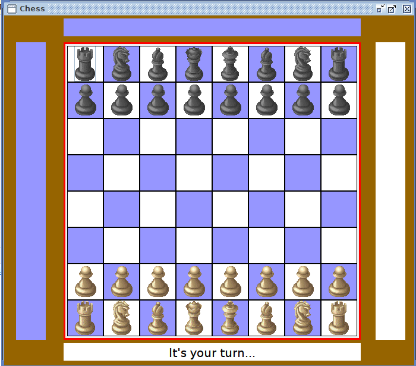
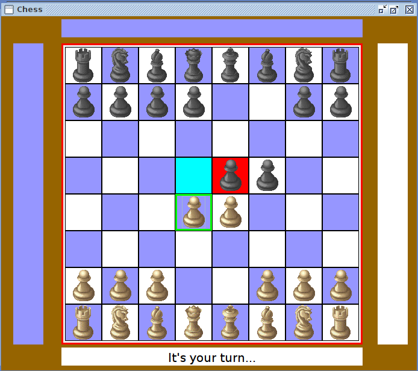

# Chess Game using AWT

This game is made using Java AWT Framework. It is a clone of a traditional chess game.
## Authors

- [@Ayush1906saxena](https://github.com/Ayush1906saxena)

## Documentation

In order to run this game on your operating system all you need to do is download 
the project and then run the "chess.jar" file.

## Features

- Follows the rules of Internation Chess Style
- Contains all the features inclusive of Castling
- Tested for Performance
- All bugs removed

## Screenshots

